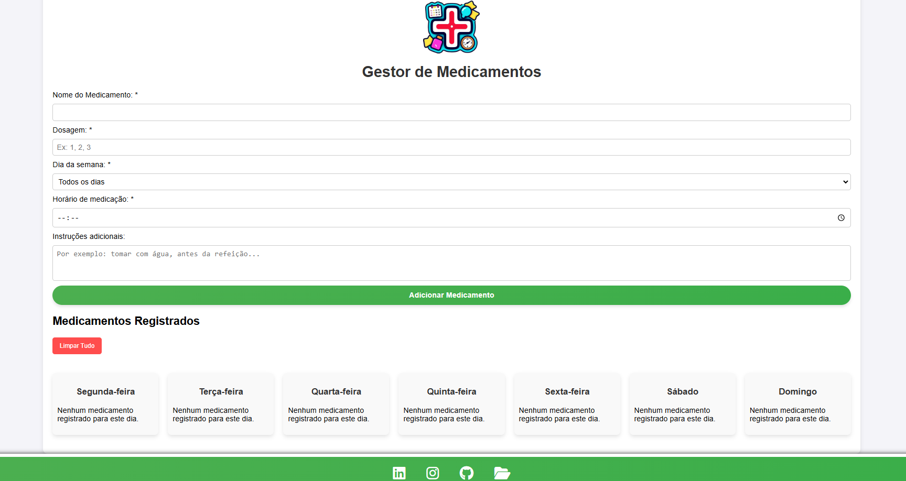

  

<h1 align="center">
  Matías Ezequiel Correa - Projeto "DoseAgenda"
</h1>

  Este é um projeto pessoal <a href="https://matias-ezequiel-correa.github.io/projeto-tcc-rascunho/" target="_blank">DoseAgenda | Seu Gestor de Medicamentos</a> desenvolvido como parte do meu TCC em Engenharia da Computação. Um sistema de gestor de medicamentos para auxiliar pessoas que precisam tomar diversos remédios no dia a dia, atualmente hospedado no <a href="https://github.com/matias-ezequiel-correa">GitHub-Pages</a>.

## Demo Video:  
* Mobile Design:
[
](https://matias-ezequiel-correa.github.io/projeto-tcc-rascunho/)

* Desktop Design:
[
](https://matias-ezequiel-correa.github.io/projeto-tcc-rascunho/)

### 🔗 Link do Projeto: <a href="https://matias-ezequiel-correa.github.io/projeto-tcc-rascunho/" target="_blank">matias-ezequiel-correa.github.io/projeto-tcc-rascunho/</a>

### Pra entrar em contato, veja as redes abaixo!
 

 
  
  
   

